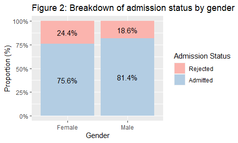
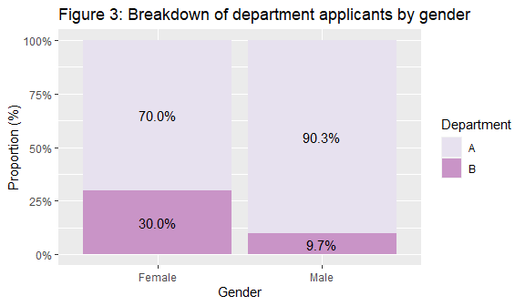
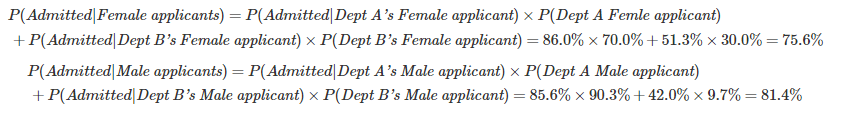

<!-- <blockquote class="twitter-tweet"><p lang="fr" dir="ltr">THE SIMPSONS PARADOX<br><br>H/T <a href="https://twitter.com/fMRI_guy?ref_src=twsrc%5Etfw">@fMRI_guy</a> <a href="https://t.co/dUbMuwWUDH">pic.twitter.com/dUbMuwWUDH</a></p>&mdash; RJ Andrews (@infowetrust) <a href="https://twitter.com/infowetrust/status/984536880199876608?ref_src=twsrc%5Etfw">April 12, 2018</a></blockquote> <script async src="https://platform.twitter.com/widgets.js" charset="utf-8"></script> -->


<!-- Table of Contents
  - [Introduction](#introduction)
  - [A simple example on university admission
    data](#a-simple-example-on-university-admission-data)
  - [Simpson paradox](#simpson-paradox)
  - [Making sense of the paradox](#making-sense-of-the-paradox)
  - [Further discussion and
    Takeaways](#further-discussion-and-takeaways)
  - [References](#references) -->

## Introduction

In data analysis, numerical results often assure us that they should
make logical sense, which usually is apparent to us. However, there are
some cases where this observation may no longer hold. Sometimes we
observe certain trends from the data in one perspective, and those
trends change disappear or reverse when we look at the data from another
perspective. One such instance is the Simpson paradox, which does
deserve appreciation and further investigation from us, especially those
who pride themselves in their love and skill for data analysis. Indeed,
the Simpson paradox has many real-world examples from [why overall US
median wage has risen when median wage for individual income groups has
declined over the same
period](https://www.nytimes.com/2013/04/27/business/economy/wage-disparity-continues-to-grow.html?_r=2&)
to [why gender bias in admission only presents in overall data but not
in department-wise
data](https://medium.com/@dexter.shawn/how-uc-berkeley-almost-got-sued-because-of-lying-data-aaa5d641f571).

Let’s start with a simple example.

## A simple example on university admission data

We have the hypothetical admission data of a university that received
about 2000 applications for two departments A, B, which I imported using
R (R Core Team 2020), `tidyverse` (Wickham et al. 2019), and `scale`
package to a dataframe called `admit_df`. `admit_df` is printed as
below.

| gender |  admit   | count | dept |
| :----: | :------: | :---: | :--: |
|  Male  | Admitted |  800  |  A   |
|  Male  | Rejected |  135  |  A   |
|  Male  | Admitted |  42   |  B   |
|  Male  | Rejected |  58   |  B   |
| Female | Admitted |  602  |  A   |
| Female | Rejected |  98   |  A   |
| Female | Admitted |  154  |  B   |
| Female | Rejected |  146  |  B   |

Let’s look at the admission status profile by gender and department. As
`dept`, `gender`, `admit` are all categorical features, we can use the
`group_by()`, `summarize()` and `mutate` on `admit_df` to calculate the
proportion of **Admitted** and **Rejected** for the respective gender by
department. I also used `ggplot` in R to create the corresponding
visualization. This visualization and subsequent visualization are not
displayed in this blog post for better readability. The detail code can
be found
[here](https://github.ubc.ca/MDS-2020-21/DSCI_542_lab2_haiyen/blob/master/blog.Rmd).

``` r
separate_dept <- admit_df %>%
  group_by(dept, gender, admit) %>%
  summarize(count = sum(count)) %>%
  mutate(prop = count / sum(count))
```

<!-- -->

As can be seen, for this hypothetical university, both department A and
department B seem to favor female candidates with the admission rate for
females is higher than that for males for both departments. Assuming
that the university has only 2 departments A, B, it seems sensible to
conclude that the admission rate for females at this university is
higher than that of males. Or does it? Let’s check this by plotting a
similar plot for the aggregate data as follows.

``` r
aggregate_dept <- admit_df %>%
  group_by(gender, admit) %>%
  summarize(count = sum(count)) %>%
  mutate(prop = count / sum(count))
```

<!-- -->

Interestingly, under the aggregate data, the admission rate for females
(\(75.6\%\)) is lower than that for males (\(81.4\%\)). What is going
on? Am I looking at the same data? Has there been a mistake? However,
this turns out to be one of the classic cases of Simpson paradox.

## Simpson paradox

**Simpson paradox**, or **Yule-Simpson effect**, is a phenomenon in
statistical studies whereby trends that appear in different groups
disappear or reverse when we aggregate data or vice versa. The paradox
is named after Edward H. Simpson, who mentioned it in his 1951 paper
(Simpson 1951). However, Simpson was not the first to discover the
concept, Karle Pearson et al. and Udny Yule has described the phenomenon
earlier in 1899 (Pearson, Lee, and Bramley-Moore 1899) and 1903 (Yule
1900) respectively, hence Yule in Yule-Simpson. The term Simpson paradox
became more popular when Colin R.Blyth mentioned it in his 1972 paper
(Blyth 1972).

Indeed, in the context of our example, the bias toward female applicants
during the admission process observed at individual departments not only
disappears but also reverses for the aggregate data where the admission
rate for male applicants is higher. Why is that so?

## Making sense of the paradox

What we have not considered is that the breakdown of applicants by
departments are different between gender. To obtain this information, I
wrangled `admit_df` using `group_by()` on `gender` and `dept` instead of
`gender` and `admit` as below.

``` r
aggregate_admit <- admit_df %>%
  group_by(gender, dept) %>%
  summarize(count = sum(count)) %>%
  mutate(prop = count / sum(count))
```

<!-- -->

From Figure 3 above, the proportion of male candidates applying for
department A is at \(90.3\%\), which is much higher than that of female
candidates. This translates to more male applicants for department A
than female as the number of female and male applicants in the data are
comparable. With the high admission rate of \(85.6\%\) in Figure 1, male
applicants for department A there would be accepted at a high number,
which outweighs the lower number of accepted male applicants for
department B.

Thus, `dept` can be thought of as the hidden or confounding variable
that affects the relationship between `gender` and `admit`.

Also, mathematically, we can use the [Law of total
probability](https://www.wikiwand.com/en/Law_of_total_probability) to
express this in one expression as below, where we can see how the
admission rates in Figure 2 are linked or reconciled with those in
Figure 1 and 3.

<!-- -->

## Further discussion and Takeaways

Now, let’s imagine you only have data for Figure 2 and do not have
access to department data yet. After reading this post, would you trust
the trend of a male preference in admission in the school above? I hope
not. Rather, before we put our faith in any analytical or statistical
findings, we should first try to understand and think critically about
data, from how it was collected or sampled to whether it is
representative of the population. If data is observational, what could
be potential unobserved variables that could affect the relationship you
are trying to understand in the data (i.e confounding variables or
confounders). In the example above, it was `dept`. However, was `dept`
the only confounder in this case? How many more should we find? The
answer on how many confounders are considered sufficient is very much
application-based and arbitrary. One way to circumvent this is to
conduct randomized studies to cancel out the effect of confounders.

All these considerations barely touch the surface of the complexity and
subtlety present in a real-world problem. In this post, I have
abstracted certain complexity away to facilitate better illustration of
the concept. However, I hope the post still demonstrates to you the
fascinating findings from the Simpson paradox, which shows that
statistical associations are not necessarily immutable and may vary
depending on the set of controlled variables (Carlson 2019). It may not
be intuitive at times, but when you develop a sober and critical sense
of viewing the data and can identify this paradox at work and avoid the
common intuitive pitfalls, it could be quite rewarding.

### References

Inspiration from
[Lab1](https://github.ubc.ca/MDS-2020-21/DSCI_554_exper-causal-inf_students/blob/master/release/lab1/lab1.Rmd)
assignment of module DSCI\_554 of Dr. Gilberto Alexi Rodriguez Arelis

Inspiration from (Grigg 2018)

<div id="refs" class="references hanging-indent">

<div id="ref-blyth1972simpson">

Blyth, Colin R. 1972. “On Simpson’s Paradox and the Sure-Thing
Principle.” *Journal of the American Statistical Association* 67 (338):
364–66.

</div>

<div id="ref-Britannica">

Carlson, B. W. 2019. “Simpson’s Paradox.” Edited by Encyclopedia
Britannica.
<https://towardsdatascience.com/simpsons-paradox-and-interpreting-data-6a0443516765>.

</div>

<div id="ref-TDS">

Grigg, Tom. 2018. “Simpson’s Paradox and Interpreting Data.”
<https://towardsdatascience.com/simpsons-paradox-and-interpreting-data-6a0443516765>.

</div>

<div id="ref-pearson1899vi">

Pearson, Karl, Alice Lee, and Leslie Bramley-Moore. 1899. “VI.
Mathematical Contributions to the Theory of Evolution.-VI. Genetic
(Reproductive) Selection: Inheritance of Fertility in Man, and of
Fecundity in Thoroughbred Racehorses.” *Philosophical Transactions of
the Royal Society of London. Series A, Containing Papers of a
Mathematical or Physical Character*, no. 192: 257–330.

</div>

<div id="ref-R">

R Core Team. 2020. *R: A Language and Environment for Statistical
Computing*. Vienna, Austria: R Foundation for Statistical Computing.
<https://www.R-project.org/>.

</div>

<div id="ref-simpson1951interpretation">

Simpson, Edward H. 1951. “The Interpretation of Interaction in
Contingency Tables.” *Journal of the Royal Statistical Society: Series B
(Methodological)* 13 (2): 238–41.

</div>

<div id="ref-tidyverse">

Wickham, Hadley, Mara Averick, Jennifer Bryan, Winston Chang, Lucy
D’Agostino McGowan, Romain François, Garrett Grolemund, et al. 2019.
“Welcome to the tidyverse.” *Journal of Open Source Software* 4 (43):
1686. <https://doi.org/10.21105/joss.01686>.

</div>

<div id="ref-yule1900vii">

Yule, George Udny. 1900. “VII. On the Association of Attributes in
Statistics: With Illustrations from the Material of the Childhood
Society, \&c.” *Philosophical Transactions of the Royal Society of
London. Series A, Containing Papers of a Mathematical or Physical
Character* 194 (252-261): 257–319.

</div>

</div>

